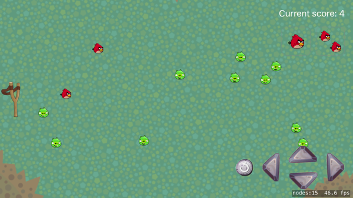

# MI-ADP: Architektury a návrhové vzory

Repozitář věnovaný semestrální práci předmětu MI-ADP, vyučovaný na FIT ČVUT (@FIT_CTU).
Seznam materiálů k ostatním předmětům je v [samostatném repozitáři](https://github.com/josefdolezal/fit-cvut).

| Přednášející | Cvičící       | Běh předmětu |
|--------------|---------------|--------------|
| Petr Špaček  | Lukáš Janeček | ZS 2017/18   |

## Semestrální práce

  

Tématem semestrální práce je hra na motivy Angry Birds s využitím architektury MVC. Práce je implementována jako hra pro iOS s využitím jazyka Swift a frameworku SpriteKit.

## Využité technologie

* Architektura MVC
* Vlastnosti
  * Strategy
  * Proxy
  * State
  * Visitor
  * Observer
  * Command
  * Memento
  * Abstract factory
* Funkce
  * Změna síly střely (force)
  * Úhlu kanónu (angle)
  * Gravitace (gravity)
  * Počítání score
  * Možnost vystřelit více střel najednou (State)
  * Ovládání modelu pomocí commandů (vzor Command)
  * Krok-zpět (Memento&Command)
  * 2 strategie pohybu střely (Strategy)

## Poznámka
Uvedené zdrojové kódy nebo jejich části slouží pro inspiraci a jako demonstrace
možného řešení problému. Důrazně nedoporučuji cizí zdrojové kódy odevzdávat/vydávat za vlastní. Pokud budete přebírat část kódu, uveďte řádně autora - předejdete tím možnému obvinění z plagiátorství ze strany školy.

Zveřejněné kódy a úlohy se mohou lišit od těch, které jsem ve škole odevzdal, nenesu tedy odpovědnost za jejich funkčnost.

## Licence
Repozitář je šířený pod licencí [MIT](LICENSE).
